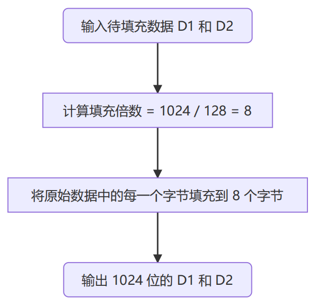

# 方案设计

## 场景一：第一步：得到加密数

通过用户输入的 key 进行两次 Enigma 机的加密，获得大小数 d1 和 d2。

其中 Enigma 机的初始位置通过用户名称设定，随机而确定。


## 场景一：第二步：得到基数 D

- MPC-Main 随机生成信息的传递路径
- 根据路径传递 d + R 的累加值
- 传递完成后，每个用户上报自己的随机数
- MPC-Main 将随机数减去获得 d 的累加值
- 重复两次以上操作获得 d1 和 d2 的累加值，sumD1 和 sumD2

这样能够保证用户的 d1 和 d2 在传递的过程中不暴露，从而保证的自己的 key 的安全性


## 场景一：第三步：生成公钥和私钥

将 128 位的 sumD1 和 sumD2 等比例扩充到 1024 位



通过 Miller-Rabin 素性测试找到素数 P 和 Q，生成 RSA 公私钥


## 场景一：第四步：可靠存储

组标识生成逻辑：格式为 ”用户数量@userName1@userName2...“

私钥存储流程：

- 根据用户数量将私钥划分成若干个私钥碎片
- 每个私钥碎片通过 [Reed Solomon](https://github.com/RobinLiew/JavaReedSolomon) 纠删码进行冗余存储，分为 4 个数据块和 2 个校验块
- 将数据块和校验块平均存储到三个存储商当中，能够保证一个存储商倒闭不影响业务


存储形式：

- 组标识 -> 公钥
- （组标识，用户名）-> 私钥碎片
- 公钥和私钥碎片都通过 Reed Solomon 进行存储，包含 4 个数据块和 2 个校验块

磁盘利用率：4/(4+2)=2/3


## 场景二：共同签名，自动验证签名

关键点：

- SignServer 自己有 RSA key，用户通过 SignServer 的公钥加密对称密钥进行密钥交换
- 用户通过对称密钥加密请求信息与 SignServer 进行交互
- 签名请求只有等到授权人数达到组人数才会发送给区块链系统


## 场景三：任意两个存储商倒闭（部分数据在），恢复密钥

核心思想：将恢复的公私钥转换成数据块，判断剩余存储商中的数据块是否有匹配块，匹配成功则说明恢复正确，反之恢复失败


# 测试

## 场景一

测试 jar 包：Scenario1Test

### 第一步：得到加密数


- 首先两个用户会生成自己的 128 位的随机数 R
- 然后每个用户输入的 key，通过 Enigma 机加密两次获得 d1 和 d2

在该测试场景下，Alice 的 key 为 abcdefgh，Bob 的 key 为 ijklmnop

### 第二步：得到基数 D


首先通过 MPC-Main 随机生成传递路径，这里是 Bob -> Alice，图中显示了在传递过程中 X 值的变化。

最后每个用户上传自己的 R 值，MPC-Main 则得到各个用户的 d1 和 d2 的累加值

### 第三步：生成公钥和私钥

首先展示了 sumD1 和 sumD2 扩展到 1024 位的结果，然后输出了找到 P 和 Q 的值


该场景下生成对应的公钥和私钥如下

```java
MIGfMA0GCSqGSIb3DQEBAQUAA4GNADCBiQKBgQDK9wAAAAAAAYw7AAAAAAACRZgAAAAAAALtSgAA
AAAAA6NmAAAAAAAEU+8AAAAAAAUPpAAAAAAABbWVAAAAAAGu7yYAAAAAAaBeHQAAAAABlqVQAAAA
AAGFHPsAAAAAAX4iZQAAAAABd+7uAAAAAAGaJT0AAAAAAYTyAAAAAABKtQIDAQAB

MIIBNgIBADANBgkqhkiG9w0BAQEFAASCASAwggEcAgEAAoGBAMr3AAAAAAABjDsAAAAAAAJFmAAA
AAAAAu1KAAAAAAADo2YAAAAAAART7wAAAAAABQ+kAAAAAAAFtZUAAAAAAa7vJgAAAAABoF4dAAAA
AAGWpVAAAAAAAYUc+wAAAAABfiJlAAAAAAF37u4AAAAAAZolPQAAAAABhPIAAAAAAEq1AgEAAoGA
CEsrjtRxK47kogyP83AMkAsz+NwHI/jcJcIeWeGmHloHtUVOurFFTuf3HjLhzR4zFr6G2Xkmhtm0
38/OMDHP37l3zgwx884dI0xCEb3uQiJJ8hDt7xIQ/cR/pTJazaVB5p078MQPPAAPP3h0h4t4hTgW
cAeP+HAXY7lURqu5V0ECAQACAQACAQACAQACAQA=
```


### 第四步：可靠存储


首先通过 MPC-Main 生成组标识，然后将公私钥和组标识传递给存储商进行存储。图中展示了私钥切片的结果

## 场景一：Enigma 机的可逆性测试

测试 jar 包：Scenario1EnigmaReversibleTest


Alice 输入的 key 为 hellolll，加密两次分别获得 drijbzvy，abmkmnfj。

分别解密后均得到根密钥 hellolll，说明具有可逆性

## 场景二

测试 jar 包：Scenario2Test

场景二的测试也包含场景一的四个步骤，主要是多了一个签名步骤


首先用户会向签名机构注册自己的对称密钥，后面通过对称密钥进行加解密请求消息。

这里我们模拟了 bob 不在线，只有授权人数足够以后才会触发签名。

签名发送给区块链系统后会自动验证。

## 场景二：可靠性测试

测试 jar 包：Scenario2ReliabilityTest

大致流程与 Scenario2Test 一致，只不过这里我们在签名之前随机破坏了一个存储商，测试是否可以正常工作。


图中，编号为 1 的存储商被破坏，可以看到后续在获取密钥块时发生错误，但还是正常完成了签名的操作

## 场景二：签名数据篡改测试

测试 jar 包：Scenario2DataTamperTest，测试数据被篡改，区块链系统是否可以识别


这里模拟将签名信息 “hello” 篡改为 “nihao”，可以看到两次计算的哈希值不同，区块链系统识别到了数据篡改

## 场景三：任意两个存储商倒闭（部分数据在），恢复密钥

测试 jar 包：Scenario3Test，先执行一次场景一的流程，后随机破坏两个存储商，通过用户输入 key 进行密钥恢复


图中，编号为 0 和 2 的存储商被破坏，随后提示用户输入 key，这里首先测试输入正确的场景。


我们将存活存储商的数据块与重新生成的 RSA 密钥对进行匹配，若寻找到匹配片段，说明恢复成功，反之恢复错误，可以看到图中 RSA 密钥正确恢复，并重新存储到存储商中。接下来测试用户输入错误的 key 的情况。


可以看到，对于用户输入 key 错误的场景，程序可以识别。
