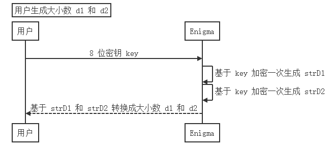

# 方案设计

* [方案设计](#方案设计)
  * [场景一：第一步：得到加密数](#场景一第一步得到加密数)
  * [场景一：第二步：得到基数 D](#场景一第二步得到基数-d)
  * [场景一：第三步：生成公钥和私钥](#场景一第三步生成公钥和私钥)
  * [场景一：第四步：可靠存储](#场景一第四步可靠存储)
  * [场景二：共同签名，自动验证签名](#场景二共同签名自动验证签名)
  * [场景三：任意两个存储商倒闭（部分数据在），恢复密钥](#场景三任意两个存储商倒闭部分数据在恢复密钥)
* [测试](#测试)

## 场景一：第一步：得到加密数

通过用户输入的 key 进行两次 Enigma 机的加密，获得大小数 d1 和 d2。

其中 Enigma 机的初始位置通过用户名称设定，随机而确定。



## 场景一：第二步：得到基数 D

- MPC-Main 随机生成信息的传递路径
- 根据路径传递 d + R 的累加值
- 传递完成后，每个用户上报自己的随机数
- MPC-Main 将随机数减去获得 d 的累加值
- 重复两次以上操作获得 d1 和 d2 的累加值，D1 和 D2

这样能够保证用户的 d1 和 d2 在传递的过程中不暴露，从而保证的自己的 key 的安全性

下图是一次 SMPC 的流程，获得 D1 和 D2 需要执行两次 SMPC


## 场景一：第三步：生成公钥和私钥

将 128 位的 D1 和 D2 等比例扩充到 1024 位

<div>

</div>

通过 Miller-Rabin 素性测试找到素数 P 和 Q，生成 RSA 公私钥


## 场景一：第四步：可靠存储

私钥存储流程：

- 根据用户数量将私钥划分成若干个私钥碎片
- 每个私钥碎片通过 [Reed Solomon](https://github.com/RobinLiew/JavaReedSolomon) 纠删码进行冗余存储，分为 4 个数据块和 2 个校验块
- 将数据块和校验块平均存储到三个存储商当中，能够保证一个存储商倒闭不影响业务


公钥存储过程：

<div>

</div>

私钥存储过程：

<div>

</div>


存储商存储形式：

- 公钥键值哈希 -> 公钥数据块
- 私钥键值哈希 -> 私钥碎片数据块
- 键值哈希计算逻辑由 MPCMain 掌控
- 公钥和私钥碎片都通过 Reed Solomon 进行存储，均包含 4 个数据块和 2 个校验块

<div>

</div>

磁盘利用率：4/(4+2)=2/3


## 场景二：共同签名，自动验证签名

关键点：

- SignServer 自己有 RSA key，用户通过 SignServer 的公钥加密对称密钥进行密钥交换
- 用户通过对称密钥加密请求信息与 SignServer 进行交互
- 签名请求只有等到授权人数达到组人数才会发送给区块链系统


## 场景三：任意两个存储商倒闭（部分数据在），恢复密钥

核心思想：将恢复的公私钥转换成数据块，判断剩余存储商中的数据块是否有匹配块，匹配成功则说明恢复正确，反之恢复失败


# 测试

首先启动六个服务，包括 MPCMain、SignServer、BlockChainSystem 和三个存储商

```java
java -jar MPCMain.jar
java -jar SignServer.jar
java -jar Storage.jar 1
java -jar Storage.jar 2
java -jar Storage.jar 3
```

启动若干个客户端，本次测试启动两个，名字分别为 jiajia 和 lele

```java
java -jar Client.jar
```


创建组 chenchen

```bash
-c@chenchen
```

MPCMain 会创建对应的组并将信息返回给客户端


另一个用户通过 uuid 加入组

```bash
-j@881fbe48ac354dac838b53c864018e22
```

客户端会给出提示是否加入成功，也可以通过 -gl 命令查看所在的组


生成 RSA 组密钥对并存储

```bash
-s1t@chenchen
```

需要组内所有人授权 MPC-Main 才会执行


进行组签名，同样是需要组内所有人授权后才会生成信件发送给区块链系统

```bash
-s2t@chenchen:nihao
-s2t@chenchen:haha

```

区块链系统收到消息以后自动验证信件的信息是否被篡改


接下来我们破坏存储商 2，测试是否业务是否能正常进行

可以看到 MPCMain 可以感知到对应的存储商是否在工作，并且不会影响业务的正常进行


接下来测试恢复密钥，下线存储商 3，此时如果再进行签名请求，会告知用户数据丢失，需要恢复密钥


```bash
-s3t@chenchen
```

我们首先故意输入错误的 key，查看程序是否能感知


再输入正确的 key，查看是否能够恢复


重新生成 rsa 密钥对会平均分配到存活的存储商中，因为此场景只存活了一个存储商，因此会将 6 个数据块都放在一起


随后，又可以正常进行业务
