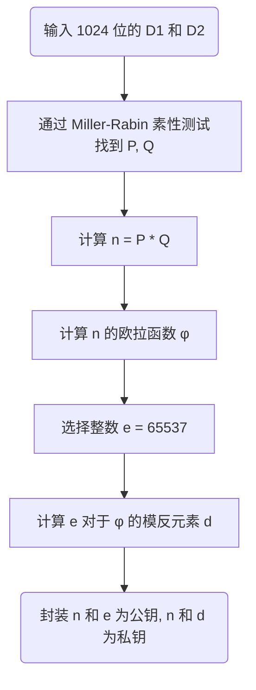
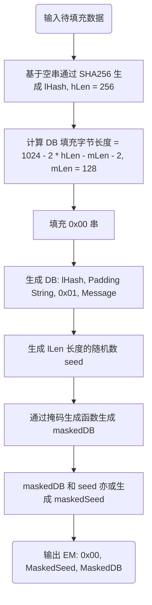
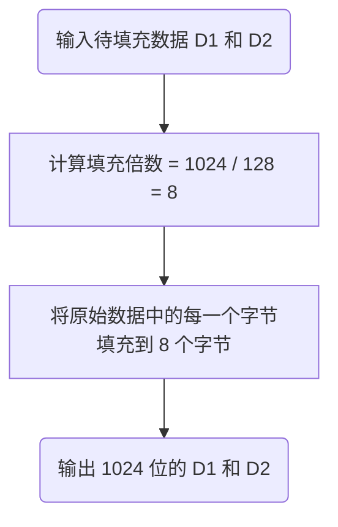
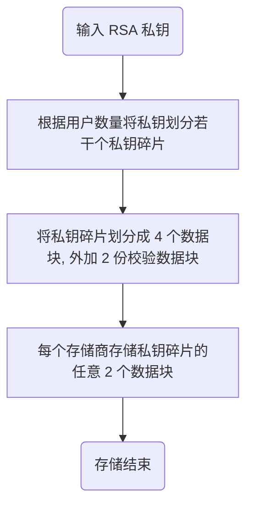

## 用户生成大小书 d1 和 d2 时序图

```sequence
Title: 用户生成大小数 d1 和 d2
用户->Enigma:8 位密钥 key
Note right of Enigma:初始位置通过用户名称设定（随机而确定）
Enigma->Enigma:基于 key 加密一次生成 strD1
Enigma->Enigma:基于 key 加密一次生成 strD2
Enigma-->用户:基于 strD1 和 strD2 转换成大小数 d1 和 d2
```

## 多方安全计算获得基数 D 时序图

```sequence
Title:多方安全计算获得基数 D
Main->Main:随机生成信息传递路径（如 1-3-2-4）
Main->User1:信息传递路劲
User1->User3:X1=R1+d1
User3->User2:X3=X1+R3+d3
User2->User4:X2=X3+R2+d2
User4-->Main:X4=X2+R4+d4
Note right of User4:128 位随机数 R 通过 SecureRandom 产生
User1-->Main:R1
User3-->Main:R3
User2-->Main:R2
User4-->Main:R4
Main->Main:sum(d)=d1+d2+d3+d4=X4-R1-R2-R3-R4
Main->Main:D1=sum(d1), D2=sum(d2)
```

```sequence
Title:多方安全计算获得基数 D
Main->Main:随机生成信息传递路径（如 2-1）
Main->User2:信息传递路径
User2->User1:X2=R2+d2
User1->Main:X1=X2+R1+d1
Note right of User1:128 位随机数 R 通过 SecureRandom 产生
User2-->Main:R2
User1-->Main:R1
Main->Main:sum(d)=d1+d2=X4-R1-R2
Main->Main:D1=sum(d1), D2=sum(d2)
```


## RSA 密钥对生成流程图



## OAEP 数据填充流程图



OAEP 数据规范：https://blog.csdn.net/RedhatJongkhurun/article/details/124539180

java 实现：https://blog.csdn.net/qunimaode/article/details/109327983


## 扩容数据填充




## 可靠存储



## 共同签名

```sequence
Title:共同签名，自动验证签名
User->User:生成 AES 对称加密密钥
User->Sign Server:获取公钥
Sign Server->Sign Server:生成 RSA 公私钥对
Sign Server-->User:返回公钥
User->User:通过公钥加密对称密钥
User->Sign Server:注册，传递加密的对称密钥
Sign Server->Sign Server:通过私钥解密获得对称密钥
User->User:通过对称密钥加密签名信息 M，包括用户名、组标识和信息，得到 EM
User->Sign Server:传递 EM
Sign Server->Sign Server:通过私钥解密 EM 获得 M
Sign Server->StorageGateway:获取对应的私钥碎片
StorageGateway-->Sign Server:返回私钥碎片
Sign Server->Sign Server:等待所有人授权，主要判断私钥碎片总长度是否符合
Sign Server->Sign Server:通过 SHA256 对要传递的消息生成摘要哈希值
Sign Server->Sign Server:通过组私钥对摘要加密，生成数字签名
Sign Server->BlockChainSystem:传递信件：信息 + 签名 + 公钥信息
BlockChainSystem->BlockChainSystem:通过公钥解密签名获得哈希值1
BlockChainSystem->BlockChainSystem:通过 SHA256 对信息生成数字摘要哈希值2
BlockChainSystem->BlockChainSystem:比对哈希值1和哈希值2是否相等，相等则信息未被串改
```


## 密钥恢复

```sequence
Title:密钥恢复
Users->Users:输入 key，获得 sumD1 和 sumD2
Users->Main:传递 sumD1 和 sumD2
Main->Main:重新生成公私钥
Main->StorageGateway:传递恢复的公私钥
StorageGateway->StorageGateway:检查私钥恢复是否正确，判断剩余数据是否能查找到匹配片段
StorageGateway->StorageGateway:检查公钥恢复是否正确，判断剩余数据是否能查找到匹配片段
StorageGateway-->Main:检查结果
Main->StorageGateway:恢复成功
StorageGateway->StorageGateway:存储公私钥
```

